  

  
  
  
  

---

## 👨‍💻 About Me

DevOps Engineer with 5+ years of experience working with cloud infrastructure,
CI/CD, containerization, Kubernetes and infrastructure automation.

I focus on building reliable, scalable and automated environments using AWS,
Azure, Kubernetes, Docker, Terraform, Ansible and modern CI/CD practices.

---

## 📊 GitHub Analytics

  
  

  

---

## 🛠️ Technology Stack

### ☁️ Cloud Platforms

  
  
  

### 🚀 DevOps & Orchestration

  
  
  
  
  

### 🔄 CI/CD

  
  
  
  

### 📈 Monitoring & Observability

  
  
  
  

### 💻 Scripting & Tools

  
  
  
  
  

---

## 🚀 What I Work On

- ☁️ AWS and Azure cloud infrastructure
- ☸️ Kubernetes and container orchestration
- 🐳 Docker and containerization
- 🔄 CI/CD pipeline automation
- 🏗️ Infrastructure as Code with Terraform
- ⚙️ Configuration management with Ansible
- 📊 Monitoring and observability
- 🔐 Secure and repeatable DevOps automation

---

## 📌 Featured Projects

| Project | Description | Technologies |
|---|---|---|
| **CloudWatch Lite** | Website monitoring and alert platform | AWS, Docker, Node.js, MySQL |
| **Terraform CI/CD** | Infrastructure deployment automation | Terraform, GitHub Actions, AWS |
| **Kubernetes Labs** | Kubernetes deployment and operations practice | Kubernetes, Docker, AWS |

---

  <b>⚡ Automate. Deploy. Monitor. Improve.</b>

